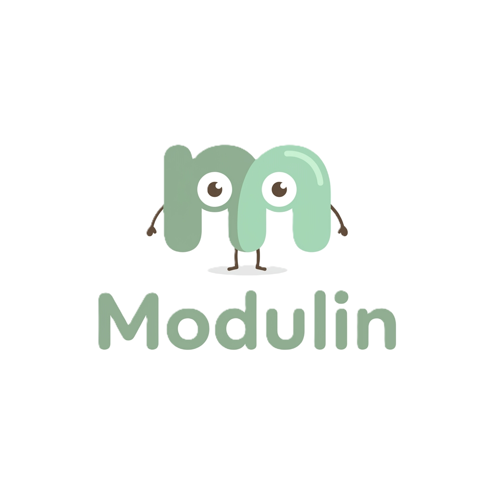

<div align="center">
  
  <h1>Modulin</h1>
  <p><strong>Generator Modul Ajar AI untuk Kurikulum Merdeka</strong></p>

  <!-- Badges -->
  <p>
    
    
    
    
  </p>
</div>

---

## 📖 Daftar Isi
1. [Tentang Proyek](#-tentang-proyek)
2. [Fitur Utama](#-fitur-utama)
3. [Arsitektur & Teknologi](#-arsitektur--teknologi)
4. [Struktur Folder](#-struktur-folder)
5. [Panduan Instalasi](#-panduan-instalasi)
6. [Alur Penggunaan (User Flow)](#-alur-penggunaan-user-flow)
7. [Roadmap](#-roadmap)

---

## 📌 Tentang Proyek

**Modulin** adalah platform revolusioner berbasis *Artificial Intelligence* (AI) yang dibangun untuk mendemokratisasi dan menyederhanakan proses administratif guru di Indonesia. Pembuatan Modul Ajar (RPP) yang sebelumnya memakan waktu berhari-hari, kini dapat diselesaikan secara komprehensif, terstruktur, dan sesuai standar **Kurikulum Merdeka** hanya dalam hitungan menit.

Dengan memanfaatkan kecerdasan generatif **Google Gemini AI**, Modulin tidak hanya menghasilkan teks dasar, tetapi secara pintar melakukan riset cakupan materi, Capaian Pembelajaran (CP), Tujuan Pembelajaran (TP), hingga menyusun rubrik penilaian dan Lembar Kerja Peserta Didik (LKPD) yang valid secara pedagogis.

---

## ✨ Fitur Utama

### 🧠 1. AI Auto-Research Engine
Cukup dengan memasukkan identitas singkat seperti "Mata Pelajaran", "Fase/Kelas", dan "Topik", AI secara otomatis:
- Menarik referensi standar capaian Kurikulum Merdeka.
- Merumuskan rasionalisasi, Capaian Pembelajaran, dan Tujuan Pembelajaran.
- Membatasi *scope* materi agar sangat relevan dengan fase kognitif siswa.

### 📚 2. Dukungan Multi-Model Pembelajaran
Generator Modulin tidak statis; ia mampu beradaptasi dengan berbagai metode pengajaran saintifik dan modern yang dianjurkan oleh Kemendikbud:
- **PBL (Problem Based Learning)**
- **PjBL (Project Based Learning)**
- **Discovery Learning & Inquiry Learning**
- **Cooperative Learning**
- Lengkap dengan *sintaks* (langkah-langkah operasional) yang disisipkan otomatis ke dalam skenario kegiatan Inti.

### 📝 3. Editor Dokumen Terintegrasi (WYSIWYG)
Modul yang dihasilkan oleh AI bukan dokumen kaku (PDF mati), melainkan masuk ke dalam **Workspace Editor (Rich Text)** layaknya Microsoft Word di dalam browser. Guru dapat memodifikasi kalimat, menambah narasi lokal, atau memperbaiki format sebelum memfinalisasi modul.

### 📄 4. One-Click Export (PDF & Word)
Mendukung ekspor langsung ke format `.pdf` (untuk langsung dicetak/dibagikan) dan `.docx` (untuk diedit lebih mendalam di MS Word di luar aplikasi).

---

## 🛠️ Arsitektur & Teknologi

Proyek ini dibangun di atas *modern web stack* untuk memastikan performa tinggi (fast-load), SEO yang dioptimasi, serta antarmuka yang sangat responsif:

- **Framework:** [Next.js (App Router)](https://nextjs.org/) - Digunakan untuk *Server-Side Rendering (SSR)* dan pengaturan *Routing* yang modern.
- **UI & Styling:** [Tailwind CSS](https://tailwindcss.com/) - *Utility-first CSS framework* untuk mempercepat pembuatan desain sistem yang presisi dan responsif.
- **Komponen & Ikon:** Menggunakan pustaka *shadcn/ui* (internalisasi) dan [Lucide React](https://lucide.dev/) untuk ikon yang bersih, ringan, dan vektor-based.
- **AI Integration:** *Google Gemini Pro API* - Model bahasa berukuran masif (LLM) yang mengatur logika pengolahan data kurikulum.
- **Tipografi:** Menggunakan kombinasi font elegan **Inter** dan **Plus Jakarta Sans** via Google Fonts.

---

## 📂 Struktur Folder

```text
📦 Exploraition-Education
 ┣ 📂 public               # Aset statis global (Ikon, Favicon, Logo maskot Modulin)
 ┣ 📂 markdown             # Dokumentasi master proyek (PRD, Arsitektur, Sistem Desain, Aturan)
 ┣ 📂 src
 ┃ ┣ 📂 app                # Core Next.js App Router (Halaman utama, Layout global, CSS)
 ┃ ┣ 📂 components         # Komponen UI Reusable (Button, Card, Form input, Navbar)
 ┃ ┗ 📂 lib                # Utility functions, helpers, dan konfigurasi library (jika ada)
 ┣ 📜 components.json      # Konfigurasi shadcn/ui dan registry komponen
 ┣ 📜 package.json         # Daftar dependensi, metadata project, dan script NPM
 ┣ 📜 tailwind.config.ts   # Konfigurasi desain sistem warna (canvas, primary, surface)
 ┗ 📜 README.md            # Dokumentasi utama repositori
```

---

## 🚀 Panduan Instalasi (Development Mode)

Untuk mengembangkan atau menjalankan proyek ini di *local machine*, pastikan Anda telah menginstal [Node.js](https://nodejs.org/) (disarankan versi 18 ke atas) dan manajer paket seperti NPM, Yarn, atau PNPM.

1. **Clone repositori ini:**
   ```bash
   git clone https://github.com/zeovarince/Exploraition-Education.git
   ```

2. **Masuk ke direktori proyek:**
   ```bash
   cd Exploraition-Education
   ```

3. **Install semua dependensi eksternal:**
   ```bash
   npm install
   ```

4. **Persiapan Environment Variable (.env):**
   *(Opsional namun disarankan saat nanti fitur AI diaktifkan)* Buat file `.env.local` di root proyek dan berikan API Key Gemini:
   ```env
   NEXT_PUBLIC_GEMINI_API_KEY="masukkan_api_key_anda_disini"
   ```

5. **Jalankan Server Development Lokal:**
   ```bash
   npm run dev
   ```

6. **Akses Aplikasi:**
   Buka peramban (browser) dan navigasikan ke [http://localhost:3000](http://localhost:3000). Setiap perubahan kode (Hot Reload) akan langsung terlihat.

---

## 🔄 Alur Penggunaan Aplikasi (User Flow)

1. **Eksplorasi Landing Page:** Pengguna membaca *value proposition* dan fitur Modulin.
2. **Form Identitas Modul:** Menekan CTA "Buat Modul" lalu mengisi form identitas (Nama Guru, Sekolah, Mapel, Kelas/Fase, Topik).
3. **Seleksi Metodologi:** Pengguna memilih metode pengajaran yang sesuai (misal: PBL).
4. **Proses Generasi AI:** Sistem memanggil *engine* AI untuk menyusun kerangka, riset materi, hingga rubrik penilaian (menampilkan layar loading yang interaktif).
5. **Mode Editor (Preview):** Modul ditampilkan secara utuh dalam editor web. Pengguna berhak menambah atau menghapus bagian tertentu.
6. **Ekspor Akhir:** Pengguna menekan tombol "Download PDF" atau "Download Word". Modul siap digunakan untuk mengajar!

---

## 🗺️ Roadmap Masa Depan (To-Do List)

- [ ] **Sistem Autentikasi (Auth):** Fitur Login/Register (menggunakan NextAuth/Clerk).
- [ ] **Cloud Storage / Database:** Integrasi Supabase atau PostgreSQL agar guru bisa menyimpan *draft* modul dan history generasi.
- [ ] **Auto-Presentation (PPT):** Fitur konversi ajaib dari Modul Ajar menjadi file Presentasi/Bahan Tayang PowerPoint.
- [ ] **Bank Soal Terintegrasi:** Generator asesmen sumatif/formatif yang langsung terhubung ke topik modul.
- [ ] **Dark Mode:** Tema mode gelap untuk kenyamanan mata pengguna saat mengedit di malam hari.

---
<div align="center">
  <i>Didesain dengan sepenuh hati untuk memajukan sistem Pendidikan Indonesia 🇮🇩</i><br>
  <b>© 2024 Modulin Team. All Rights Reserved.</b>
</div>
