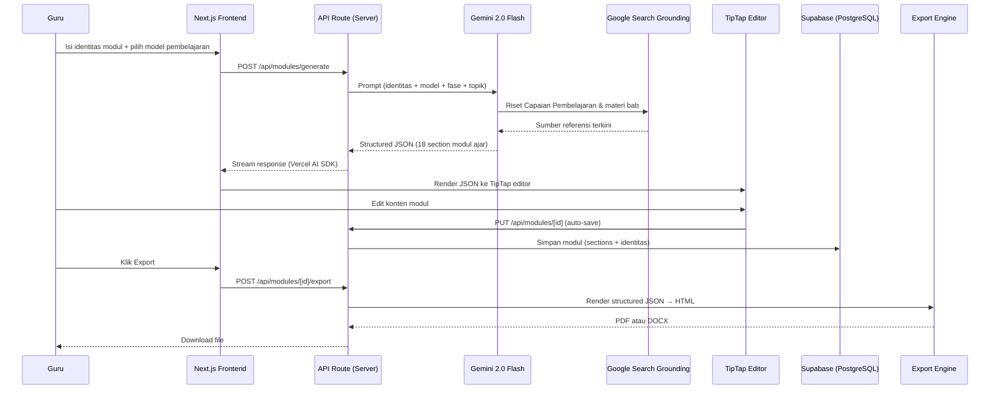

# ARSITEKTUR.md — Modulin

Dokumen arsitektur teknis untuk Modulin, aplikasi web bagi guru Indonesia untuk men-generate modul ajar sesuai Kurikulum Merdeka.

---

## 1. Overview

Alur utama sistem dari perspektif pengguna (guru) hingga output akhir:



---

## 2. Breakdown Tech Stack

| Layer | Teknologi | Alasan Spesifik |
|---|---|---|
| **Frontend** | Next.js 16 (App Router) | Server Components untuk halaman list/detail modul (SEO tidak kritis, tapi mengurangi JS bundle). API Routes di `app/api/` menjadi satu codebase dengan frontend — tidak perlu backend terpisah untuk tim kecil. |
| **Styling** | Tailwind CSS 4 | Utility-first cocok untuk iterasi cepat UI form multi-step (identitas, pilih model, editor). Tidak perlu design system custom di fase awal. |
| **Rich Text Editor** | TipTap (v3, React) | Output JSON terstruktur yang bisa dipetakan langsung ke `ModulSection[]` — setiap section modul ajar (Informasi Umum, Capaian Pembelajaran, Kegiatan Pembelajaran, dst.) menjadi satu node TipTap. Mendukung table extension untuk rubrik penilaian dan LKPD. Roadmap: collaborative editing jika ekspansi ke fitur kolaborasi antar guru. |
| **Auth & Database** | Supabase (PostgreSQL + Auth + Storage) | Auth dengan magic link cocok untuk guru yang tidak terbiasa password manager. PostgreSQL `jsonb` menyimpan `sections[]` tanpa perlu migrasi skema setiap kali template modul berubah. Storage untuk aset lampiran modul. |
| **AI** | Gemini 2.0 Flash + Google Search Grounding | Search Grounding kritis: Capaian Pembelajaran (CP) per fase/mata pelajaran harus akurat dan bersumber dari dokumen Kemendikbud terbaru. Flash dipilih karena trade-off speed vs cost — modul ajar butuh output panjang (8K+ token) tapi tidak butuh reasoning depth dari model Pro. Saat ini codebase menggunakan `gemini-2.5-flash` via `@google/genai` SDK (`src/lib/gemini.ts`). |
| **AI-Frontend Bridge** | Vercel AI SDK | `streamObject` untuk streaming structured output section-by-section ke frontend. Guru melihat modul ter-generate bertahap, bukan menunggu 30+ detik blank screen. [KEPUTUSAN DIPERLUKAN: Vercel AI SDK belum terinstall — saat ini menggunakan `@google/genai` langsung. Migrasi ke `ai` + `@ai-sdk/google` perlu dilakukan untuk streaming support.] |
| **Export** | html2pdf.js (PDF), docx (DOCX) | `html2pdf.js` sudah terinstall untuk client-side PDF generation. `docx` (v9) untuk DOCX tanpa server dependency. [KEPUTUSAN DIPERLUKAN: `html2pdf.js` menghasilkan kualitas PDF terbatas — untuk dokumen sekolah yang perlu header/footer/nomor halaman konsisten, pertimbangkan migrasi ke Puppeteer server-side atau `pdf-lib`.] |
| **Hosting** | Vercel | Zero-config deploy untuk Next.js. Edge Functions untuk API routes yang lightweight. Serverless Functions untuk endpoint berat (generate, export). |

---

## 3. Struktur Folder Next.js

Struktur aktual saat ini + folder yang akan ditambahkan (ditandai `*`):

```
src/
├── app/
│   ├── layout.tsx              # Root layout, html lang="id"
│   ├── page.tsx                # Landing page
│   ├── globals.css             # Tailwind + custom CSS variables
│   ├── favicon.ico
│   ├── create/                 # * Flow pembuatan modul (multi-step form)
│   │   └── page.tsx
│   ├── editor/                 # * TipTap editor untuk modul yang sudah di-generate
│   │   └── [id]/
│   │       └── page.tsx
│   ├── dashboard/              # * List modul milik guru
│   │   └── page.tsx
│   ├── login/                  # * Halaman auth (Supabase magic link)
│   │   └── page.tsx
│   └── api/
│       ├── modules/
│       │   ├── route.ts        # * GET (list), POST tidak dipakai di sini
│       │   ├── generate/
│       │   │   └── route.ts    # * POST — panggil Gemini, stream response
│       │   └── [id]/
│       │       ├── route.ts    # * GET, PUT, DELETE satu modul
│       │       ├── export/
│       │       │   └── route.ts # * POST — generate PDF/DOCX
│       │       ├── duplicate/
│       │       │   └── route.ts # * POST — duplikasi modul
│       │       └── regenerate-section/
│       │           └── route.ts # * POST — re-generate satu section
│       ├── models/
│       │   └── route.ts        # * GET — daftar model pembelajaran
│       └── curriculum/
│           └── phases/
│               └── route.ts    # * GET — daftar fase Kurikulum Merdeka
├── components/                 # * UI components
│   ├── editor/                 # TipTap editor wrapper + toolbar
│   ├── forms/                  # Form identitas, pilih model
│   ├── modules/                # Card modul, list modul
│   └── ui/                     # Button, Input, Modal, dll.
├── constants/
│   └── models.ts               # MODEL_PEMBELAJARAN, FASE_KURIKULUM, MODUL_SECTIONS_TEMPLATE
├── lib/
│   ├── gemini.ts               # Gemini client + generateModulAjar()
│   ├── supabase/
│   │   ├── client.ts           # Client-side Supabase (anon key)
│   │   └── server.ts           # * Server-side Supabase (service role key)
│   ├── export/                 # * PDF + DOCX generation logic
│   │   ├── pdf.ts
│   │   └── docx.ts
│   └── utils.ts                # cn() helper
└── types/
    └── modul.ts                # ModulAjar, ModulIdentitas, ModulSection, dll.
```

Catatan: File tanpa `*` sudah ada di codebase. File dengan `*` adalah rencana yang perlu diimplementasi.

---

## 4. Daftar API Routes

| Method | Path | Fungsi |
|---|---|---|
| `POST` | `/api/modules/generate` | Terima `GenerateRequest` (identitas + model pembelajaran), panggil Gemini dengan Search Grounding, stream `ModulSection[]` kembali ke client. |
| `GET` | `/api/modules` | Daftar modul milik user yang sedang login. Query param: `?status=draft\|generated\|edited\|final`, `?page=1&limit=10`. |
| `GET` | `/api/modules/[id]` | Ambil satu modul lengkap (identitas + sections). Validasi ownership via RLS. |
| `PUT` | `/api/modules/[id]` | Update modul — bisa partial (hanya sections yang diedit di TipTap, atau update status). Digunakan untuk auto-save. |
| `DELETE` | `/api/modules/[id]` | Soft delete modul (set `deleted_at`). |
| `POST` | `/api/modules/[id]/export` | Generate file export. Body: `{ format: "pdf" \| "docx" }`. Return binary file. |
| `POST` | `/api/modules/[id]/duplicate` | Buat salinan modul dengan status reset ke `draft`. Berguna untuk guru yang ingin membuat variasi modul untuk kelas berbeda. |
| `POST` | `/api/modules/[id]/regenerate-section` | Re-generate satu section spesifik. Body: `{ sectionId: string, additionalPrompt?: string }`. Guru bisa minta AI tulis ulang bagian Kegiatan Pembelajaran tanpa mengulang seluruh modul. |
| `GET` | `/api/models` | Return `MODEL_PEMBELAJARAN[]` dari `src/constants/models.ts`. Saat ini 7 model: PBL, PjBL, Discovery, Inquiry, CTL, Cooperative, Flipped Classroom. |
| `GET` | `/api/curriculum/phases` | Return `FASE_KURIKULUM[]`. Fase A-F dengan label jenjang (SD/SMP/SMA). Dipakai untuk dropdown di form identitas. |

---

## 5. Integrasi Gemini

### Client Setup (saat ini)

File `src/lib/gemini.ts` menggunakan `@google/genai` SDK:

```typescript
import { GoogleGenAI } from "@google/genai";
const ai = new GoogleGenAI({ apiKey: process.env.GEMINI_API_KEY! });
```

API key disimpan sebagai environment variable server-side only (tanpa prefix `NEXT_PUBLIC_`).

### Google Search Grounding

Konfigurasi `googleSearch` sebagai tool agar Gemini bisa riset Capaian Pembelajaran dari sumber Kemendikbud:

```typescript
const response = await ai.models.generateContent({
  model: "gemini-2.0-flash",
  contents: prompt,
  config: {
    tools: [{ googleSearch: {} }],
    temperature: 0.7,
    maxOutputTokens: 8192,
  },
});
```

Search Grounding kritis untuk section: Capaian Pembelajaran (CP), Tujuan Pembelajaran, dan Daftar Pustaka. Tanpa grounding, model bisa mengarang CP yang tidak sesuai dokumen resmi.

### Structured Output

Gunakan Vercel AI SDK `generateObject` atau `streamObject` dengan Zod schema yang memetakan ke `ModulSection[]`:

```typescript
import { streamObject } from "ai";
import { google } from "@ai-sdk/google";
import { z } from "zod";

const modulSchema = z.object({
  sections: z.array(z.object({
    id: z.string(),
    judul: z.string(),
    konten: z.string(), // HTML content
    urutan: z.number(),
  })),
});

const result = await streamObject({
  model: google("gemini-2.0-flash"),
  schema: modulSchema,
  prompt: buildPrompt(identitas, modelPembelajaran),
});
```

[KEPUTUSAN DIPERLUKAN: Migrasi dari `@google/genai` ke `ai` + `@ai-sdk/google` diperlukan untuk streaming support. Alternatif: tetap pakai `@google/genai` dengan manual SSE stream — lebih banyak boilerplate tapi menghindari tambahan dependency.]

### Rate Limit (Free Tier)

Gemini free tier: 15 RPM (requests per minute), 1M TPM (tokens per minute).

Strategi:

1. **Queue di server**: Jika concurrent user melebihi limit, masukkan request ke in-memory queue dengan estimasi waktu tunggu yang ditampilkan ke guru.
2. **Per-section generation**: Alih-alih 1 request besar (18 section), pecah menjadi batch 3-4 section per request. Ini mengurangi resiko timeout dan memungkinkan partial display. Trade-off: lebih banyak request tapi tiap request lebih kecil.
3. **Retry dengan exponential backoff**: Jika 429 (rate limit), retry setelah 4s, 8s, 16s. Maksimal 3 retry.
4. **Fallback jika grounding gagal**: Generate tanpa `googleSearch` tool, tampilkan warning ke guru bahwa Capaian Pembelajaran perlu diverifikasi manual.

### Saat Production (berbayar)

Upgrade ke Gemini API paid tier menghilangkan bottleneck 15 RPM. Budget ~$0.01-0.02 per modul (estimasi 2K input + 8K output tokens di Flash pricing).

---

## 6. Integrasi Supabase

### Client-Side (`src/lib/supabase/client.ts`)

```typescript
import { createClient } from "@supabase/supabase-js";
const supabase = createClient(
  process.env.NEXT_PUBLIC_SUPABASE_URL!,
  process.env.NEXT_PUBLIC_SUPABASE_ANON_KEY!
);
```

Digunakan untuk: auth flow (magic link login/logout), realtime subscription (opsional), dan read operations yang dilindungi RLS.

### Server-Side (`src/lib/supabase/server.ts` — belum dibuat)

```typescript
import { createClient } from "@supabase/supabase-js";
const supabaseAdmin = createClient(
  process.env.NEXT_PUBLIC_SUPABASE_URL!,
  process.env.SUPABASE_SERVICE_ROLE_KEY! // NEVER expose ke client
);
```

Digunakan di API routes untuk operasi yang membutuhkan bypass RLS: generate modul baru, export, admin operations.

### Row Level Security (RLS)

Setiap tabel yang menyimpan data guru harus punya RLS policy:

- `modules`: guru hanya bisa CRUD modul miliknya sendiri (`auth.uid() = user_id`)
- `exports`: guru hanya bisa akses file export miliknya

Detail kebijakan RLS ada di SECURITY.md.

### Storage

Supabase Storage digunakan untuk menyimpan file export (PDF/DOCX) sementara sebelum di-download. File dihapus otomatis setelah 24 jam via lifecycle policy, atau langsung setelah download selesai.

[KEPUTUSAN DIPERLUKAN: Apakah file export disimpan permanen (guru bisa re-download kapan saja) atau ephemeral (generate ulang tiap kali)? Permanen memakan storage, ephemeral memakan compute.]

---

## 7. Export Engine

### Alur Export

```
ModulAjar (JSON)
  → Gabungkan identitas + sections
  → Render ke HTML template (format dokumen sekolah)
  → Cabang:
      ├── PDF: html2pdf.js (client-side) atau Puppeteer (server-side)
      └── DOCX: docx library → Blob → download
```

### PDF

Implementasi saat ini: `html2pdf.js` (sudah terinstall) berjalan client-side. Cukup untuk MVP.

Limitasi: kontrol terbatas atas page break, header/footer, dan nomor halaman.

Upgrade path: Puppeteer headless di Vercel Serverless Function untuk kontrol penuh atas layout cetak. Membutuhkan `@sparticuz/chromium` untuk environment serverless.

### DOCX

Library `docx` (v9, sudah terinstall) men-generate file `.docx` dari JavaScript objects. Setiap `ModulSection` di-map ke `Paragraph` dan `Table` elements.

### Standar Format Dokumen Sekolah Indonesia

- Ukuran kertas: A4
- Margin: 3cm (kiri), 2.5cm (kanan, atas, bawah) — standar umum dokumen sekolah
- Font: Times New Roman 12pt untuk body, 14pt bold untuk judul section
- Header: logo sekolah (jika di-upload) + nama instansi
- Footer: halaman "X dari Y"
- Tabel rubrik penilaian: border penuh, header row bold

[KEPUTUSAN DIPERLUKAN: Apakah guru bisa customize margin/font, atau kita enforce satu standar? Rekomendasi: enforce standar dulu, buka customization berdasarkan feedback.]

---

## 8. Skalabilitas

### Cache Data Kurikulum

Capaian Pembelajaran per fase dan mata pelajaran jarang berubah (update tahunan dari Kemendikbud). Strategi:

1. **Pertama kali**: Gemini + Search Grounding mengambil CP dari sumber resmi.
2. **Cache hasil**: Simpan CP yang sudah di-ground-kan ke tabel `curriculum_cache` di Supabase, key: `(fase, mata_pelajaran)`.
3. **Request berikutnya**: Cek cache dulu. Jika ada dan belum expired (TTL: 30 hari), inject langsung ke prompt tanpa Search Grounding.
4. **Penghematan**: Mengurangi latency ~2-3 detik per request dan menghemat quota Search Grounding.

### Streaming Response

Guru melihat modul ter-generate section-by-section via SSE (Server-Sent Events):

- Section "Informasi Umum" muncul dalam 3-5 detik
- Section berikutnya muncul bertahap
- Progress bar menunjukkan "5/18 section selesai"
- Guru bisa mulai membaca/edit section awal sambil menunggu section akhir

### Edge Caching

- Data statis (`MODEL_PEMBELAJARAN`, `FASE_KURIKULUM`) di-serve dari constants file, bukan API call ke database. Sudah di-cache di build time.
- Jika data ini pindah ke database (untuk admin bisa edit tanpa deploy), gunakan Vercel Edge Config atau `Cache-Control: s-maxage=3600, stale-while-revalidate` di API route.

### Batasan Vercel Serverless

- Timeout default: 10 detik (Hobby), 60 detik (Pro).
- Generate modul bisa melebihi 10 detik. Solusi: streaming response (tidak ada single response timeout), atau upgrade ke Vercel Pro.
- [KEPUTUSAN DIPERLUKAN: Vercel plan — Hobby cukup untuk awal, tapi perlu Pro jika ada guru yang generate modul dengan 18 section penuh dalam satu request tanpa streaming.]

---

## 9. Error Handling

### Gemini API Down / Timeout

- Tampilkan pesan: "Layanan AI sedang tidak tersedia. Coba lagi dalam beberapa menit."
- Simpan input guru (identitas + model) ke `localStorage` agar tidak hilang.
- Tidak ada fallback ke model lain di fase ini. Gemini satu-satunya provider.

### Quota Exhausted (429 Rate Limit)

- Tampilkan estimasi waktu tunggu ke guru: "Antrian penuh, estimasi [X] menit."
- Auto-retry di background dengan exponential backoff.
- Jika 3 retry gagal, tawarkan guru untuk menyimpan draft (identitas saja, tanpa generated content) dan coba lagi nanti.

### AI Output Tidak Sesuai Schema

Gemini tidak selalu menghasilkan JSON yang valid, terutama tanpa structured output mode.

Strategi berlapis:

1. **Parse JSON**: Coba `JSON.parse()` response.
2. **Repair**: Jika gagal, coba perbaiki (trim markdown fences, fix trailing commas).
3. **Zod validation**: Validasi parsed object terhadap schema `ModulSection[]`.
4. **Fallback**: Jika validasi gagal, tampilkan raw text di TipTap sebagai satu section "Draft Mentah" dengan warning: "AI menghasilkan format yang tidak standar. Silakan edit manual atau coba generate ulang."
5. **Log**: Kirim malformed response ke monitoring untuk analisis pattern kegagalan.

### Network Disconnect Selama Generate

- **Auto-save partial**: Setiap section yang sudah di-stream dan diterima client langsung disimpan ke Supabase. Jika koneksi putus di section ke-8, section 1-7 tetap tersimpan.
- **Resume**: Saat guru reconnect, deteksi modul dengan status `generating` dan section yang belum lengkap. Tawarkan: "Lanjutkan generate section yang tersisa?" yang memanggil `/api/modules/[id]/regenerate-section` untuk section kosong.
- **Offline indicator**: Tampilkan banner "Koneksi terputus" dengan auto-reconnect.

### Supabase Down

- Operasi read: tampilkan data dari cache client (React state / `localStorage`).
- Operasi write (save modul): queue di `localStorage`, sync saat Supabase kembali online.
- Auth: jika session expired dan Supabase down, guru tidak bisa login. Tampilkan halaman maintenance.

---

Rujukan silang: SCHEMA.md (struktur database), AGENT.md (detail AI agent), SECURITY.md (keamanan), USERFLOW.md (alur pengguna).
