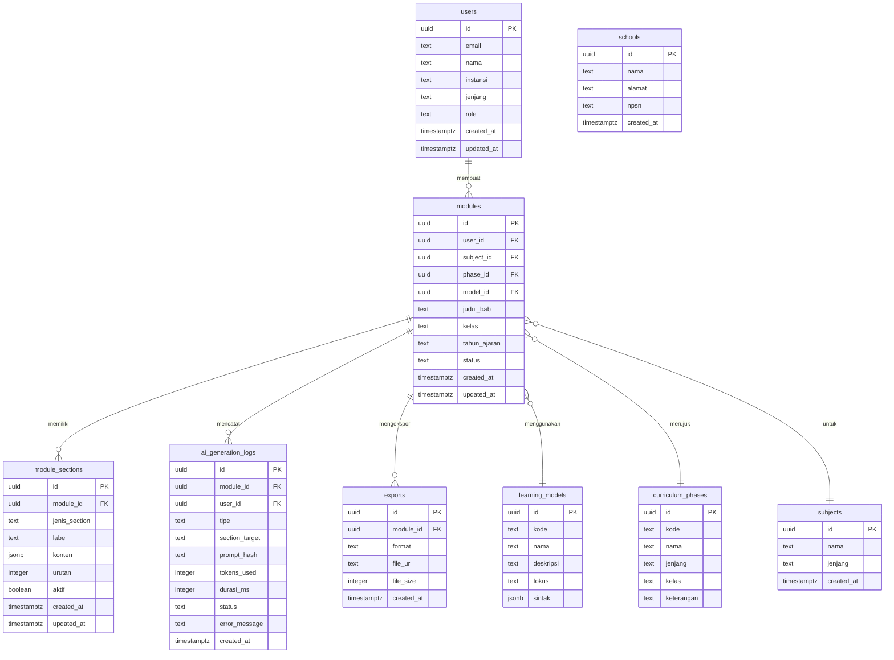

# SCHEMA.md — Modulin Database Schema

Dokumen ini mendefinisikan skema database PostgreSQL (via Supabase) untuk Modulin, aplikasi web yang membantu guru Indonesia membuat modul ajar sesuai Kurikulum Merdeka. Autentikasi menggunakan Supabase Auth dengan Google OAuth. Semua tabel menggunakan UUID sebagai primary key dan Row Level Security (RLS) diaktifkan di sisi Supabase. Dokumen ini bersifat mandiri — cukup dibaca sendiri untuk memahami struktur data lengkap.

---

## 1. Diagram ERD

---

## 2. Tabel `users`

Menyimpan profil guru yang terdaftar. Field `id` berasal langsung dari Supabase Auth (`auth.uid()`), bukan auto-generated di tabel ini.

| Kolom | Tipe | Keterangan |
|---|---|---|
| id | uuid PK | Dari Supabase Auth (`auth.uid()`). Tidak menggunakan `gen_random_uuid()` — nilainya harus sama dengan `auth.users.id`. |
| email | text NOT NULL | Email dari Google OAuth. |
| nama | text NOT NULL | Nama lengkap guru. |
| instansi | text | Nama sekolah (teks bebas untuk MVP). |
| jenjang | text | Jenjang pendidikan: `PAUD`, `SD`, `SMP`, `SMA`, `SMK`. |
| role | text DEFAULT `'guru'` | Untuk future admin role. Saat ini selalu `'guru'`. |
| created_at | timestamptz DEFAULT `now()` | |
| updated_at | timestamptz DEFAULT `now()` | |

**Primary key:** `id`
**Constraints:** `email` harus NOT NULL.
**Recommended indexes:** `email` (unique lookup saat login).

---

## 3. Tabel `schools`

**(Opsional — untuk MVP, data instansi cukup disimpan sebagai field teks di tabel `users`. Tabel ini disiapkan untuk normalisasi di fase berikutnya.)**

| Kolom | Tipe | Keterangan |
|---|---|---|
| id | uuid PK DEFAULT `gen_random_uuid()` | |
| nama | text NOT NULL | Nama sekolah. |
| alamat | text | Alamat lengkap. |
| npsn | text UNIQUE | Nomor Pokok Sekolah Nasional — identifier resmi Kemendikbud. |
| created_at | timestamptz DEFAULT `now()` | |

**Primary key:** `id`
**Constraints:** `npsn` UNIQUE (satu NPSN = satu sekolah).
**Recommended indexes:** `npsn` (lookup by official ID).

---

## 4. Tabel `learning_models`

Tabel referensi statis berisi 6 model pembelajaran yang didukung Kurikulum Merdeka. Data di-seed saat setup, tidak diubah oleh user.

| Kolom | Tipe | Keterangan |
|---|---|---|
| id | uuid PK DEFAULT `gen_random_uuid()` | |
| kode | text UNIQUE NOT NULL | Identifier singkat: `pbl`, `pjbl`, `dl`, `il`, `cooperative`, `circ`. |
| nama | text NOT NULL | Nama lengkap model. |
| deskripsi | text | Penjelasan singkat model. |
| fokus | text | Fokus utama model. |
| sintak | jsonb NOT NULL | Tahapan/langkah per fase dalam format JSON. |

**Primary key:** `id`
**Constraints:** `kode` UNIQUE NOT NULL.
**Recommended indexes:** `kode` (lookup saat form selection).

### 6 Model Pembelajaran

| Kode | Nama | Fokus |
|---|---|---|
| `pbl` | Problem-Based Learning | Pemecahan masalah nyata — proses berakhir pada **solusi**. |
| `pjbl` | Project-Based Learning | Pemecahan masalah nyata — proses berakhir pada **produk**. |
| `dl` | Discovery Learning | Penemuan konsep secara mandiri melalui eksplorasi. |
| `il` | Inquiry Learning | Penyelidikan ilmiah berbasis pertanyaan. |
| `cooperative` | Cooperative Learning | Kolaborasi terstruktur dalam kelompok kecil. |
| `circ` | Cooperative Integrated Reading and Composition | Literasi membaca dan menulis secara kooperatif. |

**Catatan penting:** PBL dan PjBL sering tertukar. Perbedaan kunci: PBL berakhir pada **solusi** (analisis masalah), PjBL berakhir pada **produk** (artefak nyata yang dihasilkan siswa). Sintak keduanya berbeda dan disimpan terpisah di kolom `sintak`.

---

## 5. Tabel `curriculum_phases`

Tabel referensi statis berisi fase-fase Kurikulum Merdeka. Data di-seed saat setup.

| Kolom | Tipe | Keterangan |
|---|---|---|
| id | uuid PK DEFAULT `gen_random_uuid()` | |
| kode | text UNIQUE NOT NULL | `fondasi`, `a`, `b`, `c`, `d`, `e`, `f`. |
| nama | text NOT NULL | Fase Fondasi, Fase A, dst. |
| jenjang | text NOT NULL | Jenjang yang sesuai. |
| kelas | text | Rentang kelas. `null` untuk Fondasi. |
| keterangan | text | Catatan khusus. |

**Primary key:** `id`
**Constraints:** `kode` UNIQUE NOT NULL.
**Recommended indexes:** `kode`, `jenjang`.

### Pemetaan Fase Kurikulum Merdeka

| Kode | Nama | Jenjang | Kelas | Keterangan |
|---|---|---|---|---|
| `fondasi` | Fase Fondasi | PAUD/TK/RA | — | Menggunakan **capaian perkembangan**, bukan capaian pembelajaran. Struktur modul berbeda dari fase lainnya. |
| `a` | Fase A | SD/MI | 1-2 | |
| `b` | Fase B | SD/MI | 3-4 | |
| `c` | Fase C | SD/MI | 5-6 | |
| `d` | Fase D | SMP/MTs | 7-9 | |
| `e` | Fase E | SMA/SMK/MA | 10 | |
| `f` | Fase F | SMA/SMK/MA | 11-12 | |

---

## 6. Tabel `subjects`

Menyimpan daftar mata pelajaran.

| Kolom | Tipe | Keterangan |
|---|---|---|
| id | uuid PK DEFAULT `gen_random_uuid()` | |
| nama | text NOT NULL | Nama mata pelajaran. |
| jenjang | text | Jenjang di mana mapel ini berlaku (SD, SMP, SMA, dst). |
| is_custom | boolean DEFAULT `false` | Menandakan apakah mapel diinput mandiri oleh guru. |
| created_by | uuid FK → `users.id` | User yang membuat custom subject jika `is_custom = true`. |
| created_at | timestamptz DEFAULT `now()` | |

**Primary key:** `id`
**Recommended indexes:** `jenjang` (filter mapel berdasarkan jenjang guru).

---

## 7. Tabel `modules`

Tabel utama perangkat ajar. Satu row = satu modul ajar yang dibuat guru, lengkap dengan metadata identitas dan payload 10 komponen terstruktur (BSKAP No. 032/H/KR/2024).

| Kolom | Tipe | Keterangan |
|---|---|---|
| id | uuid PK DEFAULT `gen_random_uuid()` | |
| user_id | uuid FK → `users.id` NOT NULL | Guru pembuat modul. |
| subject_id | uuid FK → `subjects.id` | Mata pelajaran resmi (bisa null jika custom). |
| phase_id | uuid FK → `curriculum_phases.id` | Fase kurikulum resmi. |
| model_id | uuid FK → `learning_models.id` | Model pembelajaran yang dipilih. |
| mata_pelajaran | text | Nama mata pelajaran dalam bentuk teks bebas. |
| jenjang | text | Jenjang pendidikan (`PAUD`, `SD`, `SMP`, `SMA`, `SMK`). |
| fase | text | Fase kurikulum (`Fondasi`, `A`, `B`, `C`, `D`, `E`, `F`). |
| kelas | text | Kelas spesifik dalam fase (misal: 1, 7, 10). |
| judul_bab | text NOT NULL | Judul bab / materi pokok modul. |
| topik | text | Sub-topik spesifik perangkat ajar. |
| tahun_ajaran | text NOT NULL | Contoh: `"2026/2027"`. |
| alokasi_waktu | text | Contoh: `"2 x 45 menit (1 Pertemuan)"`. |
| status | text DEFAULT `'draft'` | CHECK (`status IN ('draft', 'generated', 'edited', 'final', 'archived')`). |
| structured_data | jsonb | Data terstruktur 10 komponen resmi modul ajar (BSKAP No. 032/H/KR/2024). |
| html_content | text | Konten rich text HTML dari TipTap Editor siap cetak. |
| deleted_at | timestamptz | Timestamp soft delete (NULL jika aktif). |
| created_at | timestamptz DEFAULT `now()` | |
| updated_at | timestamptz DEFAULT `now()` | |

**Primary key:** `id`
**Foreign keys:**
- `user_id` → `users.id`
- `subject_id` → `subjects.id`
- `phase_id` → `curriculum_phases.id`
- `model_id` → `learning_models.id`

**Constraints:** `status` CHECK IN (`'draft'`, `'generated'`, `'edited'`, `'final'`, `'archived'`).
**Recommended indexes:**
- `user_id` — query semua modul milik guru.
- `status` — filter draft vs final.
- `deleted_at` — filter modul aktif.
- Composite: `(user_id, status, created_at DESC) WHERE deleted_at IS NULL` untuk query dashboard aktif.

---

## 8. Tabel `module_sections`

Menyimpan konten modul per komponen modular. Satu modul terdiri dari 10 komponen acuan resmi BSKAP No. 032/H/KR/2024 yang bisa diaktifkan/dinonaktifkan oleh guru.

| Kolom | Tipe | Keterangan |
|---|---|---|
| id | uuid PK DEFAULT `gen_random_uuid()` | |
| module_id | uuid FK → `modules.id` ON DELETE CASCADE | Cascade delete: hapus modul = hapus semua section-nya. |
| jenis_section | text NOT NULL | Tipe section resmi (lihat 10 komponen di bawah). |
| label | text | Nama tampilan di UI. |
| konten | jsonb | Konten terstruktur atau TipTap JSON untuk rich text. |
| konten_html | text | Render HTML siap cetak untuk bagian bersangkutan. |
| urutan | integer NOT NULL | Urutan tampil (1 s.d. 10). |
| aktif | boolean DEFAULT `true` | Guru bisa enable/disable section tanpa menghapus data. |
| created_at | timestamptz DEFAULT `now()` | |
| updated_at | timestamptz DEFAULT `now()` | |

**Primary key:** `id`
**Foreign keys:** `module_id` → `modules.id` ON DELETE CASCADE.
**Constraints:** `jenis_section` NOT NULL, `urutan` NOT NULL.
**Recommended indexes:**
- `module_id` — query semua section dalam satu modul.
- `(module_id, urutan)` — sorted retrieval.

### Pemetaan 10 Komponen Resmi Modul Ajar (BSKAP No. 032/H/KR/2024)

1. `informasi_umum`: Identitas modul, penyusun, institusi, tahun, jenjang, fase, kelas, alokasi waktu.
2. `tujuan_pembelajaran`: Teks resmi CP/Perkembangan, domain elemen, tujuan pembelajaran (TP), pertanyaan pemantik, lingkungan belajar.
3. `profil_pelajar_pancasila`: Dimensi dan elemen karakter Profil Pelajar Pancasila yang disasar.
4. `materi_alat_bahan`: Materi pokok, sumber belajar buku teks, serta sarana prasarana/fasilitas.
5. `model_pembelajaran`: Model terpilih (PBL, PjBL, Discovery, Inquiry, Cooperative, CIRC) beserta metode pembelajaran.
6. `kegiatan_pembelajaran`: Urutan sintaks lengkap: Pendahuluan, Inti (langkah sintaks per model), dan Penutup.
7. `asesmen`: Target penilaian, jenis asesmen (diagnostik/formatif/sumatif), kriteria ketercapaian, dan tabel rubrik penilaian.
8. `refleksi`: Evaluasi pedagogis guru dan lembar refleksi peserta didik.
9. `daftar_pustaka`: Rujukan resmi buku teks kurikulum merdeka dan sumber belajar tervalidasi.
10. `pengayaan_remedial`: Program pengayaan bagi murid tuntas dan bimbingan remedial bagi murid belum tuntas.
*Tambahan:* `lembar_pengesahan` (tanda tangan kepala sekolah & guru pengajar) dan `lampiran` (LKPD, glosarium).

---

## 9. Tabel `ai_generation_logs`

Mencatat setiap pemanggilan AI untuk audit, debugging, dan analisis usage. Tidak menyimpan prompt lengkap demi privasi — hanya hash-nya.

| Kolom | Tipe | Keterangan |
|---|---|---|
| id | uuid PK DEFAULT `gen_random_uuid()` | |
| module_id | uuid FK → `modules.id` | Modul yang di-generate. |
| user_id | uuid FK → `users.id` | Guru yang memicu generasi. |
| tipe | text | `'full'` (seluruh modul) atau `'partial'` (regenerasi satu section). |
| section_target | text | `null` untuk full generation, nama section untuk partial. |
| prompt_hash | text | Hash dari prompt yang dikirim ke AI. **Bukan** prompt lengkap — untuk alasan privasi. |
| tokens_used | integer | Total token yang digunakan (input + output). |
| durasi_ms | integer | Waktu proses dalam milidetik. |
| status | text | `'success'`, `'error'`, `'timeout'`. |
| error_message | text | Pesan error jika `status != 'success'`. |
| created_at | timestamptz DEFAULT `now()` | |

**Primary key:** `id`
**Foreign keys:**
- `module_id` → `modules.id`
- `user_id` → `users.id`

**Recommended indexes:**
- `user_id` — query usage per guru.
- `module_id` — history generasi per modul.
- `created_at` — analisis trend.
- `status` — filter error untuk monitoring.

---

## 10. Tabel `exports`

Mencatat setiap file yang diekspor. File disimpan di Supabase Storage, URL-nya dicatat di sini.

| Kolom | Tipe | Keterangan |
|---|---|---|
| id | uuid PK DEFAULT `gen_random_uuid()` | |
| module_id | uuid FK → `modules.id` | Modul yang diekspor. |
| format | text | CHECK (`format IN ('pdf', 'docx')`). |
| file_url | text | URL file di Supabase Storage. |
| file_size | integer | Ukuran file dalam bytes. |
| created_at | timestamptz DEFAULT `now()` | |

**Primary key:** `id`
**Foreign keys:** `module_id` → `modules.id`.
**Constraints:** `format` CHECK IN (`'pdf'`, `'docx'`).
**Recommended indexes:** `module_id` (lookup export history per modul).

---

Rujukan silang: SECURITY.md (kebijakan RLS per tabel), ARSITEKTUR.md (integrasi Supabase), AGENT.md (skema output AI yang dipetakan ke module_sections). Data referensi learning_models dan curriculum_phases bersumber dari riset kurikulum di master prompt bagian 5.
