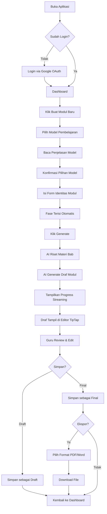

# USERFLOW.md — Modulin

Dokumen ini mendeskripsikan seluruh alur penggunaan aplikasi Modulin dari perspektif guru sebagai pengguna tunggal. Modulin adalah web app untuk guru Indonesia yang men-generate modul ajar sesuai Kurikulum Merdeka. Guru mengisi identitas modul, memilih model pembelajaran, AI melakukan riset materi via Google Search Grounding dan menghasilkan draf terstruktur, lalu guru meninjau dan mengedit draf di TipTap editor sebelum mengekspor sebagai PDF atau Word. Dokumen ini dapat dibaca secara independen, tetapi merujuk ke PRD.md untuk user stories, ARSITEKTUR.md untuk detail API, dan RULES.md untuk Definition of Done.

---

## 1. Flow Utama

### Diagram Alur

### Deskripsi Tiap Langkah

**Buka Aplikasi**
Guru mengakses URL Modulin di browser. Landing page menampilkan deskripsi singkat produk dan tombol login. Tidak ada konten yang bisa diakses tanpa autentikasi.

**Login**
Autentikasi via Google OAuth melalui Supabase Auth. Setelah consent, guru di-redirect ke dashboard. Session disimpan oleh Supabase — guru tidak perlu login ulang selama session belum expired. Untuk guru baru, profil (nama, email) otomatis terisi dari akun Google.

**Dashboard**
Halaman utama setelah login. Menampilkan:
- Daftar modul milik guru: judul modul, tanggal dibuat/diubah, status (draft / final).
- Tombol "Buat Modul Baru" sebagai CTA utama.
- Aksi per modul: buka, duplikasi, hapus.

Jika guru belum memiliki modul, tampilkan empty state dengan panduan singkat dan tombol "Buat Modul Baru".

**Pilih Model Pembelajaran**
Halaman atau modal yang menampilkan enam model pembelajaran yang didukung:

| Model | Inti |
|-------|------|
| PBL (Problem-Based Learning) | Dimulai dari masalah nyata, berhenti di solusi/ide |
| PjBL (Project-Based Learning) | Berbasis proyek, menghasilkan produk nyata |
| Discovery Learning | Penemuan konsep melalui eksplorasi terbimbing |
| Inquiry Learning | Investigasi dari pertanyaan yang dirumuskan siswa |
| Cooperative Learning | Kerja kelompok dengan akuntabilitas individu |
| CIRC | Kooperatif berbasis membaca-menulis |

Setiap model menampilkan penjelasan singkat (2-3 kalimat), kapan cocok digunakan, dan contoh hasil akhir. Perbedaan PBL vs PjBL ditampilkan secara eksplisit: PBL berhenti di analisis dan solusi, PjBL berlanjut hingga produk jadi (artefak, presentasi, prototipe). Guru membaca penjelasan terlebih dahulu, lalu mengkonfirmasi pilihan sebelum lanjut ke form.

**Isi Form Identitas Modul**
Form dengan field berikut:

| Field | Tipe | Keterangan |
|-------|------|------------|
| Nama guru | Text input | Pre-filled dari profil pengguna |
| Nama instansi / sekolah | Text input | Pre-filled dari profil jika sudah diisi sebelumnya |
| Mata pelajaran | Dropdown atau search | Daftar mapel; opsi free text jika tidak ditemukan |
| Jenjang | Dropdown | PAUD/TK, SD, SMP, SMA/SMK |
| Kelas | Dropdown | Difilter berdasarkan jenjang yang dipilih |
| Bab / topik | Text input (free text) | Judul bab atau topik yang akan diajarkan |
| Tahun ajaran | Dropdown | Format: 2026/2027 |
| Fase | Auto-fill (read-only) | Terisi otomatis berdasarkan jenjang + kelas |

Pemetaan fase otomatis:

| Jenjang | Kelas | Fase |
|---------|-------|------|
| PAUD/TK | - | Fondasi |
| SD | 1-2 | A |
| SD | 3-4 | B |
| SD | 5-6 | C |
| SMP | 7-9 | D |
| SMA/SMK | 10 | E |
| SMA/SMK | 11-12 | F |

Guru tidak perlu menghafal pemetaan fase — sistem mengisi otomatis begitu jenjang dan kelas dipilih.

**AI Riset & Generate**
Setelah guru menekan tombol "Generate", sistem menjalankan dua tahap:

1. **Riset materi**: Gemini 2.0 Flash dengan Google Search Grounding mencari scope materi bab, Capaian Pembelajaran (CP) resmi dari dokumen Kemendikbud, dan referensi faktual terkini.
2. **Penyusunan draf**: AI menyusun modul ajar lengkap mengikuti tiga komponen resmi Kurikulum Merdeka — Informasi Umum, Komponen Inti, dan Lampiran.

Selama proses berlangsung, tampilkan indikator progres: streaming response via Vercel AI SDK menampilkan section-by-section saat ter-generate. Guru melihat progress bar ("5/18 section selesai") dan bisa mulai membaca section yang sudah muncul.

**Review & Edit**
Draf AI ditampilkan di TipTap rich text editor. Setiap section modul ajar (Informasi Umum, Capaian Pembelajaran, Kegiatan Pembelajaran, dst.) ditampilkan sebagai blok yang bisa di-collapse dan di-expand. Kemampuan editor:

- Format teks dasar: bold, italic, heading, list, tabel.
- Reorder section via drag-and-drop.
- Enable/disable section (misalnya menghapus section Pengayaan jika tidak relevan).
- Tombol "Regenerate" per section — AI menulis ulang section tersebut tanpa mengubah section lain.
- Undo/redo.

Guru bertanggung jawab meninjau dan menyesuaikan konten dengan konteks kelas mereka. Disclaimer ditampilkan: "Draf ini dihasilkan oleh AI. Guru wajib meninjau dan menyesuaikan sebelum digunakan."

**Simpan**
Dua opsi status:

- **Draft**: modul disimpan dengan status draft. Disclaimer tetap melekat: "Modul ini belum ditandai sebagai final." Guru bisa kembali mengedit kapan saja.
- **Final**: modul ditandai sebagai final. Status berubah di dashboard. Opsi ekspor langsung ditampilkan.

**Ekspor**
Setelah menyimpan sebagai final, guru ditawari opsi ekspor:

- **PDF**: file siap cetak dengan format dokumen sekolah Indonesia (A4, Times New Roman 12pt, margin standar, header instansi, footer nomor halaman).
- **Word (.docx)**: file yang bisa diedit lebih lanjut di Microsoft Word — banyak sekolah memerlukan format Word untuk arsip dan penyerahan ke kepala sekolah.

File langsung ter-download ke perangkat guru.

---

## 2. Flow Sekunder

### Membuka Modul Lama

Dari dashboard, guru mengklik judul modul yang sudah ada. Modul terbuka di TipTap editor dengan seluruh konten yang tersimpan terakhir. Guru bisa melanjutkan editing, mengubah status, atau mengekspor. Tidak ada perbedaan fungsional antara membuka modul draft dan modul final — keduanya bisa diedit.

### Menduplikasi Modul

Tersedia dari dashboard (aksi pada item modul) maupun dari dalam editor. Tombol "Duplikasi" membuat salinan modul dengan ID baru dan status reset ke draft. Identitas modul (nama guru, instansi, mapel, bab) ikut tersalin; guru mengubah field yang perlu disesuaikan (biasanya kelas). Use case utama: guru yang mengajar mata pelajaran sama di beberapa kelas paralel (misal Matematika di kelas 7A, 7B, 7C) — cukup duplikasi dan sesuaikan konteks kelas.

### Regenerasi Parsial

Di dalam editor, setiap section modul memiliki tombol "Regenerate". Saat diklik:

1. Tampilkan dialog konfirmasi: "Section ini akan ditulis ulang oleh AI. Konten saat ini akan digantikan. Lanjutkan?"
2. Guru bisa menambahkan instruksi tambahan (optional prompt) sebelum konfirmasi, misal: "Buat kegiatan inti lebih interaktif."
3. AI men-generate ulang hanya section tersebut. Section lain tetap utuh.
4. Hasil baru menggantikan konten lama di editor. Undo tersedia jika guru ingin mengembalikan versi sebelumnya.

Endpoint: `POST /api/modules/[id]/regenerate-section`.

### Edit Profil

Guru mengakses halaman profil dari menu navigasi. Field yang bisa diubah:

- Nama lengkap
- Nama instansi / sekolah
- Jenjang default (pre-fill di form identitas modul berikutnya)

Perubahan profil tidak mengubah modul yang sudah dibuat — hanya memengaruhi pre-fill form modul baru.

---

## 3. Edge Cases

### AI Gagal Generate (Koneksi Putus)

Jika koneksi terputus selama streaming response:
- Section yang sudah diterima client otomatis tersimpan ke Supabase sebagai draft.
- Tampilkan pesan: "Koneksi terputus. Silakan coba lagi."
- Tombol retry tersedia. Saat di-retry, sistem mendeteksi section yang sudah ada dan hanya men-generate section yang belum selesai.
- Jika tidak ada section yang berhasil diterima, input guru (identitas + model) disimpan ke `localStorage` agar tidak hilang.

### Kuota Habis

Jika Gemini API mengembalikan 429 (rate limit):
- Tampilkan pesan: "Batas generate harian tercapai. Silakan coba lagi besok."
- Sisa kuota ditampilkan di UI (di dashboard dan di form generate) agar guru tahu sebelum memulai.
- Input guru disimpan agar bisa langsung generate begitu kuota tersedia.

### Hasil AI Tidak Lengkap

Jika response AI gagal melewati validasi Zod schema (JSON malformed atau section tidak lengkap):
- Tampilkan konten yang berhasil diterima di editor.
- Banner peringatan di bagian atas: "Beberapa bagian modul tidak berhasil di-generate. Anda dapat mengisi manual atau mencoba generate ulang."
- Section yang gagal ditandai dengan indikator visual (border merah atau label "belum ter-generate") dan tombol "Regenerate" di masing-masing section.
- Raw text yang tidak bisa di-parse ditampilkan dalam satu section "Draft Mentah" sebagai fallback.

### Guru Menutup Browser di Tengah Generate

- Auto-save berjalan selama streaming: setiap section yang sudah diterima langsung disimpan ke database.
- Modul mendapat status `generating` (bukan `draft`).
- Saat guru login kembali, dashboard menampilkan modul dengan status "Belum selesai generate" dan opsi: "Lanjutkan generate section yang tersisa" atau "Simpan sebagai draft (konten parsial)".

### Guru Mengedit Lalu Ekspor Tanpa Menyimpan

Jika guru mengklik tombol Export dan ada perubahan yang belum disimpan:
- Tampilkan dialog: "Simpan perubahan sebelum mengekspor?"
- Tiga opsi:
  - **Simpan & Ekspor**: simpan perubahan, lalu generate file export.
  - **Ekspor Tanpa Simpan**: generate export dari konten yang ada di editor (termasuk perubahan belum tersimpan), tapi perubahan tidak disimpan ke database.
  - **Batal**: kembali ke editor.

### Guru Memilih Jenjang PAUD

Saat jenjang PAUD/TK dipilih di form identitas:
- Fase otomatis terisi "Fondasi".
- Terminologi form berubah: "Capaian Perkembangan" menggantikan "Capaian Pembelajaran".
- AI prompt menyesuaikan: struktur modul menggunakan pendekatan bermain-belajar, bukan instruksi akademis formal. Section kegiatan pembelajaran menggunakan terminologi yang sesuai dengan Fase Fondasi.
- Enam dimensi Profil Pelajar Pancasila diterapkan sesuai konteks PAUD (bukan SD/SMP/SMA).

### Export Gagal

Jika proses export gagal (misal server timeout atau library error):
- Tampilkan pesan error: "Export gagal. Silakan coba lagi."
- Tombol retry tersedia.
- Jika satu format gagal (misal PDF), tawarkan format alternatif: "Export sebagai PDF gagal. Coba export sebagai Word?"
- Modul tetap tersimpan di database — tidak ada data yang hilang karena kegagalan export.

---

## 4. Catatan UX

**Loading states**: Semua state loading harus memiliki indikator visual yang jelas. Gunakan spinner untuk aksi singkat (simpan, navigasi), skeleton screen untuk loading halaman, dan progress bar dengan persentase section untuk proses AI generation.

**Auto-save**: Editor menyimpan perubahan otomatis setiap 30 detik. Indikator kecil di toolbar menunjukkan status: "Tersimpan" (dengan timestamp) atau "Menyimpan..." saat proses berlangsung. Jika auto-save gagal (koneksi putus), tampilkan warning dan simpan ke `localStorage` sebagai fallback.

**Keyboard shortcuts**: Implementasikan shortcut standar untuk aksi editor yang sering digunakan — Ctrl+S (simpan manual), Ctrl+Z / Ctrl+Y (undo/redo), Ctrl+B / Ctrl+I (bold/italic). Daftar shortcut bisa diakses via Ctrl+/.

**Mobile responsiveness**: Aplikasi harus berfungsi di layar mobile karena banyak guru Indonesia mengakses internet utamanya via smartphone. [KEPUTUSAN DIPERLUKAN: Prioritas mobile responsiveness di MVP — apakah mobile-first atau desktop-first dengan responsive fallback? Pertimbangan: form input dan model selection cukup straightforward di mobile, tapi TipTap editor experience menurun signifikan di layar kecil. Rekomendasi: desktop-first dengan form input yang mobile-friendly, editor optimized untuk desktop.]

---

Rujukan silang: PRD.md (user stories yang dipetakan ke flow ini), ARSITEKTUR.md (API routes yang mendukung tiap langkah), RULES.md (Definition of Done yang mengacu alur utama ini).
